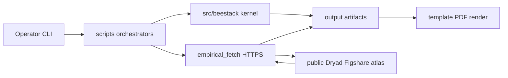

# BeeStack threat model

Evidence anchors use repository-relative paths under the BeeStack project root
(the project's own checkout directory; in the private projects workspace this is
symlinked as `projects_in_progress/BeeStack` for template discovery).

## Executive summary

BeeStack’s highest realistic risks are **supply-chain compromise of Python or
FlyBody/MuJoCo dependencies**, **SSRF or host escape via empirical download
paths**, **zip-slip or malicious archive content during BeeBrain ingest**, and
**misinterpretation of reduced simulation outputs as operational beekeeping or
biosecurity guidance**. The codebase is an offline CLI with a single curated
HTTPS fetch module; it does not expose network listeners or store tenant secrets.
Priority review paths are `src/beestack/brain/empirical_fetch.py`,
`src/beestack/brain/empirical_ingest.py`, `scripts/analysis_pipeline.py`, and
the dataset registry in `src/beestack/brain/datasets.py`.

## Scope and assumptions

**In scope**

- Runtime: `src/beestack/`, `scripts/`, `docs/manuscript/`, generated `output/`
- Build/dev: `pyproject.toml`, `uv.lock`, pytest/pre-commit when run locally
- Empirical fetch/ingest against public Dryad, Figshare, and FU Berlin atlas hosts

**Out of scope**

- Parent `template/` CI runners and GitHub Actions (separate threat model)
- FlyBody upstream repository and MuJoCo binary supply chain (referenced, not authored)
- Future live-hive sensor coupling (named in roadmap only)

**Assumptions (explicit)**

1. Operators run BeeStack on trusted single-user research workstations.
2. Internet exposure is **outbound HTTPS only** during optional empirical fetch.
3. No multi-tenant data or shared credentials are stored by BeeStack.
4. Manuscript PDFs are published as research artifacts, not operational control interfaces.

**Open questions (would change ranking if answered differently)**

1. Will BeeStack later run as a shared server with uploaded user datasets?
2. Will hive sensor streams enter the pipeline with live API credentials?
3. Is the target deployment environment regulated (e.g., government health data)?

## System model

### Primary components

| Component | Role | Evidence |
| --- | --- | --- |
| Analysis orchestrator | Runs simulation, figures, audits | `scripts/analysis_pipeline.py` |
| Domain kernel | Deterministic BeeBody–BeeNiche logic | `src/beestack/orchestrator.py` |
| Empirical fetch | HTTPS download of curated public datasets | `src/beestack/brain/empirical_fetch.py` |
| Empirical ingest | Zip/CSV/MAT/XLSX parsing | `src/beestack/brain/empirical_ingest.py` |
| FlyBody adapter | MuJoCo scene render and verification | `src/beestack/body/flybody_adapter.py` |
| Manuscript hydration | Token replacement from JSON artifacts | `scripts/z_generate_manuscript_variables.py` |
| Security posture gate | Static allowlist and pattern audit | `src/beestack/security/posture.py` |

### Data flows and trust boundaries

- **Operator → CLI scripts** — shell argv, local `docs/manuscript/config.yaml`; trust: operator-controlled; validation: `yaml.safe_load`, config validators in `src/beestack/config.py`.
- **CLI → local `output/`** — JSON, PNG, GIF, PDF artifacts; trust: same user; validation: integrity and figure audits.
- **Fetch module → public data hosts (HTTPS)** — archives and anatomy assets; trust boundary: remote public repositories; validation: `validate_download_url` host allowlist (`src/beestack/security/url_policy.py`).
- **Ingest → zip members** — nested archives from downloaded payloads; trust boundary: remote file content; validation: `assert_safe_zip_member` (`src/beestack/security/path_safety.py`).
- **Manuscript → PDF renderer (template infra)** — hydrated markdown; trust: local prose + generated figures; validation: Pandoc/LaTeX pipeline in parent template.

#### Diagram

## Assets and security objectives

| Asset | Why it matters | Security objective (C/I/A) |
| --- | --- | --- |
| Curated empirical archives | BeeBrain calibration integrity | I, A |
| `uv.lock` / dependencies | Reproducible, tamper-evident builds | I |
| Manuscript claim ledger | Prevents false scientific attribution | I |
| Operator workstation | Entry point for supply-chain attacks | C, I |
| Generated PDFs | External publication surface | I |
| Future API credentials (not present) | Would gate live hive data | C |

## Attacker model

### Capabilities

- Substitute malicious PyPI/wheel packages if lockfile or index is compromised
- Trick operator into fetching from attacker-controlled URL if allowlist fails
- Ship zip-slip or polyglot archives that escape `output/data/empirical_sources/`
- Misuse reduced dance/pheromone outputs for dual-use planning (non-technical)

### Non-capabilities (without changed assumptions)

- Remote unauthenticated RCE against a BeeStack daemon (none exists)
- Cross-tenant data access (no tenancy)
- OAuth/session hijack of in-app users (no auth system)

## Entry points and attack surfaces

| Surface | How reached | Trust boundary | Notes | Evidence |
| --- | --- | --- | --- | --- |
| Shell CLI | `uv run python scripts/...` | Operator → scripts | Primary control plane | `scripts/*.py` |
| YAML config | `docs/manuscript/config.yaml` | Operator → config | Drives simulation parameters | `src/beestack/config.py` |
| HTTPS fetch | empirical pipeline | Internet → fetch | Curated hosts only | `empirical_fetch.py` |
| Zip ingest | post-download analysis | Remote archive → parser | Zip-slip risk | `empirical_ingest.py` |
| FlyBody/MuJoCo | animation scripts | Local toolchain → render | Native code dependency | `body/flybody_adapter.py` |
| Hydrated manuscript | PDF stage | Local files → renderer | Claim injection if audits skipped | `docs/manuscript/*.md` |

## Top abuse paths

1. **Dependency confusion** — attacker publishes typosquat package → operator `uv sync` → arbitrary code at import → read local empirical data and manuscript drafts.
2. **SSRF via fetch URL** — malicious registry edit or API response redirects fetch to internal metadata service → exfiltration (low likelihood while allowlist enforced).
3. **Zip-slip ingest** — crafted Dryad archive member `../../.ssh/authorized_keys` → parser writes outside target dir (mitigated by member checks; verify on every nested archive).
4. **Artifact tampering** — operator replaces `output/data/*.json` without rerunning pipeline → manuscript hydrates false numbers → incorrect published claims.
5. **Dual-use misread** — reader treats waggle contact-sheet figures as calibrated biosecurity tooling → harmful field decisions (governance, not CVE).

## Threat model table

| Threat ID | Threat source | Prerequisites | Threat action | Impact | Impacted assets | Existing controls (evidence) | Gaps | Recommended mitigations | Detection ideas | Likelihood | Impact severity | Priority |
| --- | --- | --- | --- | --- | --- | --- | --- | --- | --- | --- | --- | --- |
| TM-001 | Supply-chain actor | Compromised dependency or index | Trojans build or runtime via pip/uv | RCE on workstation | lockfile, source tree | `uv.lock`, no `shell=True` scan in posture audit | No Sigstore/cosign verification | Pin index; periodic `uv lock --check`; optional SBOM export | Fail posture audit on forbidden imports | medium | high | high |
| TM-002 | Network attacker | Allowlist bypass or HTTP downgrade | Fetch internal or malicious payload | Data poison, SSRF | empirical archives | `validate_download_url` HTTPS + host suffixes; post-redirect re-validation in `empirical_fetch._open_validated_response` | Redirect chains to unlisted hosts if validation skipped | Keep redirect check on every response; extend tests when adding hosts | Log rejected URLs; compare sha256 manifests | low | high | low |
| TM-003 | Malicious archive author | Archive accepted into ingest | Zip-slip or billion-file zip DoS | FS escape, DoS | workstation, output | `assert_safe_zip_member`; `validate_zip_archive_bounds` (5k members / 5GB uncompressed per archive) | Nested depth not capped separately | Monitor ingest timing; tighten caps if abuse observed | Ingest timing metrics | low | medium | low |
| TM-004 | Insider / operator | Write access to repo or output | Edit JSON artifacts or disable audits before PDF | False scientific claims | manuscript, PDF | documentation + figure + source + security posture audits via `analysis_pipeline.py` and `verify_generated_reports.py` | No signed-artifact or SBOM gate yet | Run full pipeline before PDF; diff `output/reports/*.json` | Diff report JSON against pipeline logs | medium | medium | medium |
| TM-005 | Misuse reader | Interprets reduced model as operational | Applies dance/pheromone outputs to field biosecurity | Ecological/agricultural harm | reputation, bees | ethics section, unsupported_inference captions | No runtime “not for operations” banner in CLI | Keep governance prose; readiness JSON names gaps | N/A (governance) | medium | medium | medium |
| TM-006 | APT (nation-state) | Long-term access to dev machine | Tamper FlyBody/MuJoCo binaries or GPU drivers | Silent wrong physics evidence | render artifacts | FlyBody hard-fail without backend | No code-signing verification of MuJoCo install | Verify toolchain checksums on install docs | Visual verification reports | low | high | medium |
| TM-007 | APT supply chain | Compromise upstream FlyBody | Malicious task code at render | RCE during animation | workstation | Optional FlyBody group in template | External dep outside BeeStack lock | Document trusted install path; isolate render in container | Hash FlyBody checkout tag | low | high | medium |
| TM-008 | Future integrator | Adds hive API credentials | Stores tokens in config/repo | Credential leak | future hive data | Not implemented | No secret scanner in BeeStack-local hooks | Use env vars + secret scan if APIs added | gitleaks on commit | low | high | low (conditional) |

## Criticality calibration

| Priority | Meaning for BeeStack |
| --- | --- |
| **critical** | Unauthenticated remote code execution or undetected tampering of published empirical claims at scale |
| **high** | Workstation RCE via dependencies, or successful SSRF/archive escape |
| **medium** | Audit bypass leading to wrong manuscript numbers; zip DoS; toolchain tampering without detection |
| **low** | Conditional future API secret exposure before hive coupling exists |

Examples: TM-001 high (dependency trojan); TM-002 medium (allowlist + HTTPS); TM-005 medium (misuse, not CVE).

## Focus paths for security review

| Path | Why it matters | Related Threat IDs |
| --- | --- | --- |
| `src/beestack/brain/empirical_fetch.py` | Sole urllib fetch surface | TM-002, TM-003 |
| `src/beestack/security/url_policy.py` | Host allowlist contract | TM-002 |
| `src/beestack/brain/empirical_ingest.py` | Archive parsing | TM-003 |
| `src/beestack/brain/datasets.py` | Curated URL registry | TM-002, TM-004 |
| `scripts/analysis_pipeline.py` | Central orchestration | TM-004 |
| `src/beestack/security/posture.py` | Automated posture gate | TM-001, TM-004 |
| `docs/manuscript/16_ethics_governance.md` | Dual-use and governance | TM-005 |
| `pyproject.toml` / `uv.lock` | Dependency integrity | TM-001, TM-006 |
| `src/beestack/body/flybody_adapter.py` | Native render toolchain | TM-006, TM-007 |

## Quality check

- [x] Entry points covered: CLI, YAML, HTTPS fetch, zip ingest, FlyBody, manuscript
- [x] Trust boundaries represented in threats TM-002..TM-007
- [x] Runtime vs CI/dev separated in scope section
- [x] Assumptions explicit; open questions listed (user validation deferred)
- [x] Output format matches AppSec template sections
