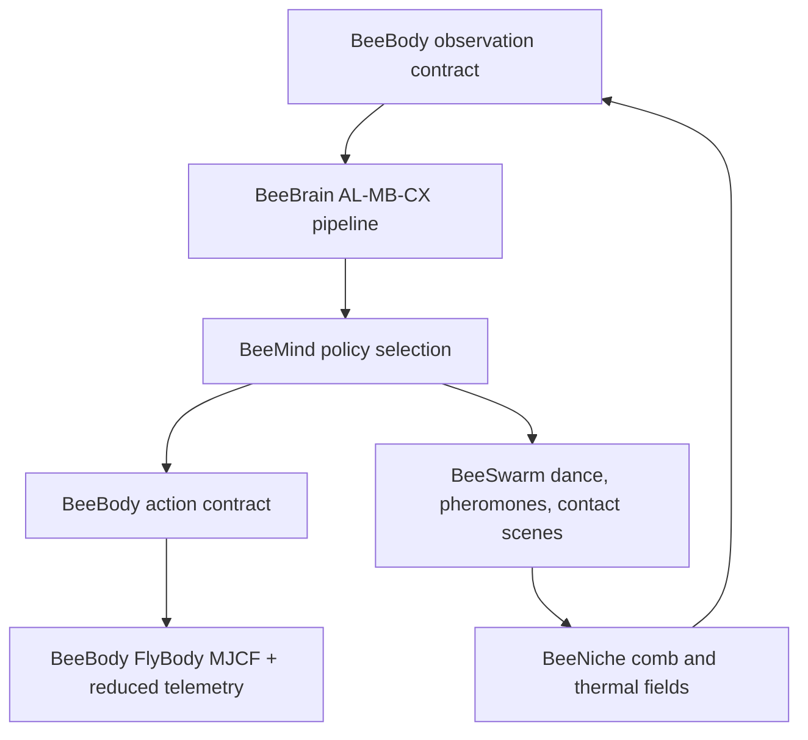

# Architecture

BeeStack is implemented as a standalone project in the research-template style.
BeeBody uses a FlyBody/MuJoCo render path, and production BeeSwarm
waggle/collision animations reuse the same generated BeeBody MJCF inside
strict MuJoCo contact scenes. The other v0 module backends are intentionally
reduced so the five-layer contract stays executable while leaving
higher-fidelity replacements as explicit extension points.

## Directory Roles

- `src/beestack/`: pure Python package; no project file I/O.
- `tests/`: zero-mock unit and integration tests against source behavior.
- `scripts/`: thin orchestration for outputs.
- `manuscript/`: paper source with `{{VARIABLE}}` tokens.
- `output/`: regeneratable artifacts.

## Module Boundaries

`config.py` preserves manifest-driven parameters and guards tractability
constraints. `contracts.py` defines typed BeeBody observations/actions. The
five biological modules live in subpackages: `body/`, `brain/`, `mind/`,
`swarm/`, and `niche/`. `visualization/` owns deterministic figures, and
`utils/` owns cross-cutting pure helpers. `orchestrator.py` composes them into
the reduced closed loop.
`integrity.py` provides the stack-level review surface: typed records for
public APIs, contracts, config knobs, validations, diagnostics, empirical
evidence, fidelity level, and known gaps.
`research/` adds the science-first report layer: typed module scorecards,
empirical evidence records, visualization inventories, sensitivity sweeps, and
known-gap statements. It consumes generated summaries from the five modules but
does not perform file I/O itself; `scripts/run_research_suite.py` and
`scripts/analysis_pipeline.py` own the output writes under `output/reports/`,
`output/figures/research/`, `output/interactive/`, and
`output/data/sensitivity/`.

The animation pipeline is module-aligned: BeeBody emits FlyBody walking
and flight GIFs; BeeSwarm emits strict FlyBody/MuJoCo collision, configured
waggle, and long waggle scenes plus a reduced recruitment-field summary; Brain,
Mind, and Niche emit deterministic reduced module GIFs under
`output/animations/`. Alt text, captions, fidelity groups, BeeBody visual
signatures, and strict-scene contact summaries live in
`output/data/animation_manifest.json`. BeeBody walking is rendered by FlyBody's
`WalkImitation` and `rollout_and_render`; BeeBody flight is rendered by
`FlightImitationWBPG`, `WingBeatPatternGenerator`, and `rollout_and_render`.
The strict BeeSwarm scenes prefix-copy the generated
`apis_mellifera_worker.xml` body plan into multi-bee MuJoCo XMLs, add free
joints/contact proxies/floor geometry, step `MjData`, render with
`mujoco.Renderer`, and write contact reports.

## Evidence Traceability

Every major architectural claim has a machine-readable trace:

- contracts and module coverage: `output/data/model_card.json` and
  `output/data/module_coverage.json`;
- strict Body/Swarm visualization evidence:
  `output/data/animation_manifest.json` and
  `output/reports/flybody_contact_physics.md`;
- empirical BeeBrain evidence: `output/data/empirical_analysis.json` and
  `output/data/brain_data_completeness.json`;
- science-first summaries: `output/reports/beestack_research_report.md` and
  `output/reports/methods_analysis.md`;
- prose synchronization: `output/data/manuscript_variables.json` and
  `output/manuscript/`.

This traceability is intentional: a future module can become more realistic
only by satisfying the same contracts and refreshing the same evidence surfaces.

## Extension Points

- Point `BEESTACK_FLYBODY_PATH` at a checked-out BeeStack FlyBody fork to use
  fork-owned assets instead of patching the installed upstream asset set.
- Replace `brain.kenyon_sparse_code` with Brian2, Nengo, or SpikingJelly.
- Replace `mind.select_policy` with full variational active inference.
- Scale `swarm` with learned Level 1 surrogates.
- Replace `niche` arrays with sparse GPU voxels, while keeping the current
  BEEHAVE/Hiveopolis-compatible summaries as adapter outputs.
