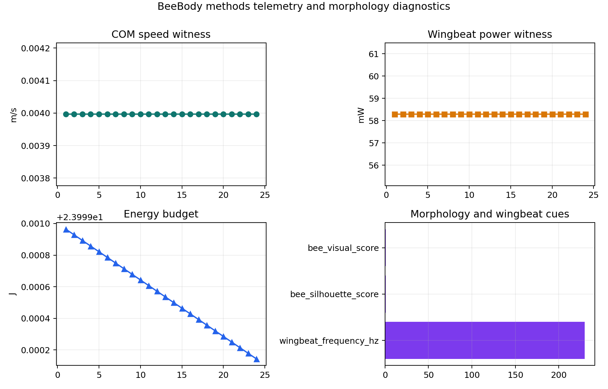

# BeeBody Methods

BeeBody owns the morphology, physics, sensors, actions, and energetics of
an individual worker, and is the most stringent fidelity boundary in the
stack. The worker body defaults to 80.0 mg mass, a
230 Hz wing stroke, and 59 FlyBody
action channels. Production animations use FlyBody walking and
flight tasks driven through MuJoCo [@vaxenburg2025flybody;
@todorov2012mujoco]; a reduced deterministic closed-loop kernel runs in
parallel for telemetry tests.

## Body plan generation

The body-plan generator writes `apis_mellifera_worker.xml` by modifying a
FlyBody-compatible body plan while preserving every task-facing joint and
body name, so the upstream control tasks continue to work without
modification. The generated MJCF adds honey-bee visual cues that survive
the renderer: four translucent wings with hindwing coupling, an amber
abdomen with dark tergite bands, enlarged compound eyes, antennae,
mouthparts, a stinger, thoracic fuzz, corbiculae on the hind legs, and a
constricted petiolar waist. These cues are not treated as proof of
calibrated biomechanics. They are an auditable *visual* body-plan layer
on top of the FlyBody execution path: the verification script measures
non-blank dynamic frames, motion pixels, locomotion mode, MJCF cue
presence, silhouette overlap with a reference bee shape, and the
*absence* of FlyBody debug aids inconsistent with the honeybee render.

## Walking and flight tasks

Walking animations load the generated body plan through FlyBody
`WalkImitation` and render frames with `rollout_and_render`. Flight
animations use `FlightImitationWBPG` plus a `WingBeatPatternGenerator`,
and the same render path. Both pipelines apply task-specific masks:
`disable_wings_for_walk = true` and `disable_legs_for_flight = true`
prevent unphysical co-activation that would otherwise drag the COM
trajectory off the reference. The future-step horizon
(`future_steps = 64`) and the `flight_future_steps = 5` setting come
from the FlyBody defaults; deviating from them changes the imitation
loss landscape, so they are pinned in `config.yaml`.

The latest verification run reports a BeeBody visual score of
0.980 (cue coverage) and a silhouette score of
1.000 (shape overlap). These are perceptual scores
on the rendered GIF, not biomechanical scores; they certify that the
output *looks like a bee*, not that it *moves like one*.

The methods layer now also records a conservative honeybee calibration
scorecard. The current morphology score is
1.000, with an inertia-rescaling witness of
0.820. These values are generated from
configured mass, segment proportions, four-wing coupling, and contact
proxy counts; they are readiness checks for the generated MJCF, not a
claim that honeybee inertial tensors have been fully measured.

## Sensors and observations

BeeBody emits an `Observation` record for every control step. It packs
visual frames (downsampled from the configured per-eye ommatidia to a
compressed tensor), olfactory channels (one per glomerulus, with
log-domain projection), mechanosensory state (proprioception, antennal
contact, leg-load), and a thermosensory scalar. Sensor noise levels —
$\sigma_\text{visual} = 0.02$, $\sigma_\text{olfactory} = 0.03$,
$\sigma_\text{mechano} = 0.01$ — are documented in `config.yaml` so that
sensitivity sweeps can perturb them without code edits.

## Actions and energetics

Actions are unpacked from a 59-dimensional vector
into leg torques (4 DOF/leg, 6 legs), wing kinematics (3 DOF/wing,
coupled hamuli at the wing root), antennal pose, and mandible state.
Energy accounting is multiplicative and reference-anchored, not a
fitted aerodynamic model: hovering wing power is pinned to a fixed
~58 mW worker reference (≈80 mg body mass, ≈230 Hz stroke) and scaled
by dimensionless terms — a mass$^{0.75}$ allometric factor, a *linear*
stroke-frequency ratio, and load/wing-wear penalties. Leg power scales
with foot-strike load and resting metabolic rate is a floor. The integrated run reports a mean wing power of
58.291 mW and a final body-frame energy budget of
23.999 J after 24 control steps.

## Methods telemetry panel

The methods-analysis layer adds a Body telemetry dashboard that treats
the reduced closed-loop motion as a *witness* rather than a substitute
for FlyBody. It summarizes COM-speed proxy traces, wing-power traces,
energy budget change, configured wing-beat frequency, and morphology
cue scores in
`output/figures/methods/beebody_methods_telemetry_dashboard.png`.

{#fig:body_methods_dashboard}

## Fidelity boundary

BeeBody remains the most stringent fidelity boundary in the stack. It
is FlyBody-backed for production rendering, and the visual
verification confirms that the output *looks like a bee*. The underlying
articulated topology, mass distribution, inertia tensors, adhesion
model, wing aerodynamics, and leg-tip contact mechanics still require
honey-bee-specific biomechanical calibration. This is a recognized
limitation and a roadmap priority: visual fidelity is
necessary but not sufficient for biomechanical claims, and BeeStack
reports this limitation rather than folding it into a single fidelity score.
