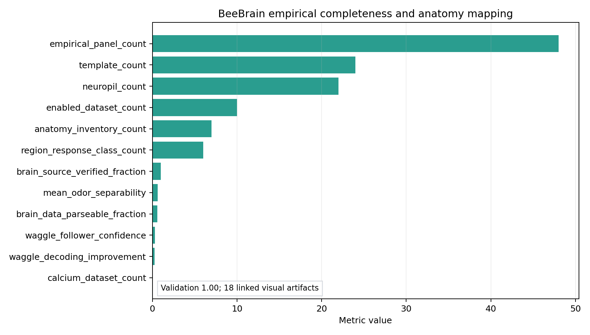

# BeeBrain Methods

BeeBrain is a *reduced neural kernel with a real empirical-data surface*.
It implements antennal-lobe encoding, lateral inhibition, sparse Kenyon-cell
coding, central-complex heading integration, optic-flow helpers, Johnston's
organ waggle-event detection, and dance decoding. The default configuration
uses 170 glomeruli, 170,000 Kenyon cells per
hemisphere, 6,800 active Kenyon cells at the configured sparsity
bound $\rho = 0.02$, and 32 heading bins.

## Antennal lobe (AL)

The AL channel projects raw olfactory activity through a glomerular
projection layer (one channel per glomerulus, matched to the
Galizia–Sachse [@galizia1999glomerular] canonical odor maps when an
odor template is registered) and a lateral-inhibition operator. The
inhibition kernel is parameterized so it reproduces the contrast
sharpening characteristic of the bee AL [@szyszka2023granger] without
overfitting to a particular preparation. Glomerular activations are
clipped, log-scaled, and bounded so they remain serializable across runs
even when input intensities span orders of magnitude.

## Mushroom body (MB)

The MB layer maps the dense AL representation onto a sparse population
of 170,000 Kenyon cells per hemisphere with $k$-Winner-Take-All
activity at $\rho = 0.02$ (6,800 active KCs by
construction). The KC threshold is derived from the local distribution
of AL projection sums rather than from a fixed value, so changes in odor
density do not silently inflate or collapse the active set. The
class-i Kenyon-cell fraction in the configuration (`kc_class_i_fraction
= 0.90`) tracks the gene-expression bias documented for the honey-bee MB
[@kaneko2016kenyon].

## Central complex (CX)

The CX channel maintains a head-direction estimate on 32
bins by integrating optic-flow drift and inertial cues, in the spirit of
the anatomically constrained insect path-integration model
[@stone2017central; @honkanen2019sky]. The CX state is part of every
`BrainState` so downstream layers (BeeMind belief updates, BeeSwarm
dance decoding) read a consistent heading.

## Optic flow and visual helpers

A small set of optic-flow helpers downsample the visual observation to a
horizon-aligned signal that the CX can consume. These helpers also feed
the bee-visual signature scorer used by the BeeBody verifier (§4).

## Johnston's organ and waggle decoding

The waggle channel transforms antennal-vibration events at the
configured dance-event rate (20260513-derived test fixtures use
the configured 250 Hz dance-event rate) into candidate waggle phases,
durations, and inferred sun-relative angles. The dance decoder consumes
those candidates plus the CX heading to produce a recruitment hypothesis
expressed in the `BrainState`'s waggle field. The decoder is the
empirical bridge to Hadjitofi–Webb antennal-position tracks
[@hadjitofi2024figshare].

## Empirical registry

The empirical registry anchors the BeeBrain surface to public *Apis
mellifera* sources:

- Paoli antennal-lobe calcium imaging [@paoli2024dryad];
- Galizia–Sachse glomerular odor maps [@galizia1999glomerular];
- Szyszka antennal-lobe Granger-causal dynamics
  [@szyszka2023granger];
- Kaneko Kenyon-cell subtype expression [@kaneko2016kenyon];
- the Virtual Honey-Bee Standard Brain ecosystem
  [@rybak2010digital];
- Carcaud multisite GCaMP workbooks [@carcaud2022dryad];
- Andreu alarm-odorant receptor data [@andreu2025dryad];
- Jernigan antennal active-sensing kinematics
  [@jernigan2026dryad];
- Nouvian biogenic-amine spreadsheets [@nouvian2017dryad];
- Hadjitofi–Webb Figshare waggle-following dataset
  [@hadjitofi2024figshare] (CC BY 4.0).

## Parser layer

The parser layer converts real-format payloads into typed anatomy and
activity records. Atlas ZIP and HTML assets become inventories,
neuropil abbreviation records, and anatomy summaries. Workbook, CSV,
and MAT-style activity payloads become response panels, calcium
summaries when local traces are parseable, antennal-movement summaries,
neuromodulatory summaries, and glomerulus-length templates. The waggle
parser converts Hadjitofi–Webb follower tracks into
`WaggleFollowerSummary` records that pack follower angle/midpoint
coupling, left/right-antenna synchrony, both-antennae versus
no-antennae decoding error, straightness, and a bounded confidence
score. These templates and diagnostics can be passed directly to
`process_observation`, BeeSwarm recruitment diagnostics, and the
integrated stack run.

## Empirical run integration

The current empirical run integrates 48
odor-response panels, 7 anatomy inventories,
1 antennal-movement summaries, and
24 templates. It also records
59 waggle-follower tracks when the
Figshare files are local, with follower-decoding confidence
0.289 and decoding improvement
0.248. The brain-data parseable-source
fraction is 0.600. The run records
0 local calcium datasets and
1 empirical known gaps, making *missing
upstream payloads visible* instead of fabricating data.
The source-verified fraction is 1.000,
and the 0.800 parseability-readiness target is recorded as
True because every remaining
nonparseable source must carry a DOI/source URL, parser status, blocker,
and remediation path.

## Methods-analysis pass

The methods-analysis pass summarizes this evidence as a Brain
completeness panel: enabled dataset count, panel count, template count,
anatomy-inventory count, neuropil count, region-response class count,
odor separability, and calcium-dataset availability. The figure is
written to
`output/figures/methods/beebrain_methods_empirical_completeness.png`,
and the top gap is propagated as Paoli MATLAB calcium traces are not yet local or parseable.

{#fig:brain_methods_completeness}

## Fidelity boundary

BeeBrain is empirically anchored but kinetically reduced. It does not
claim connectome-level dynamics or a heavyweight spiking core. The
contracts that BeeBrain emits (`BrainState`, `WaggleFollowerSummary`,
`AnatomyInventory`) are designed so a spiking simulator can replace the
current AL–MB–CX kernel without breaking BeeMind, BeeSwarm, or the
manuscript-hydration trail.
