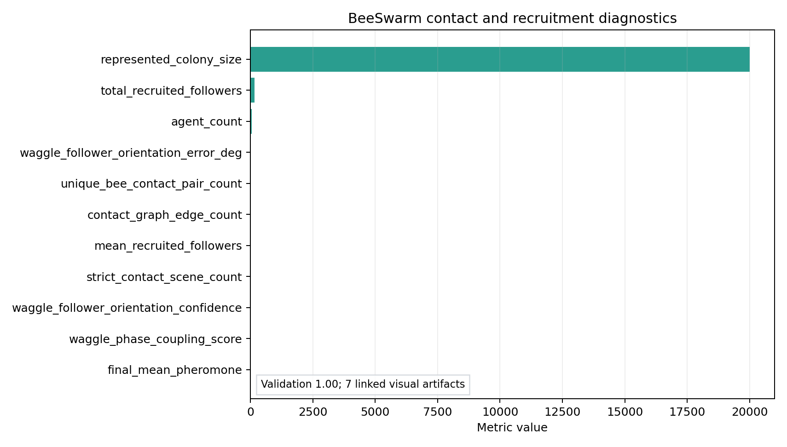

# BeeSwarm Methods

BeeSwarm covers two distinct fidelity regimes that meet at the same
contracts but exercise the stack in very different ways. The
*reduced communication kernel* models dance recruitment, pheromone
fields, and task allocation for a colony of 50 simulated
agents representing 20,000 workers, and is
designed for contract testing and sensitivity analysis. The *strict
visualization channel* renders multi-bee MuJoCo scenes with full
BeeBody MJCF copies, providing contact-physics evidence at the
small-scene scale.

## Reduced communication kernel

The reduced kernel initializes 50 agents, broadcasts dance
recruitment events drawn from the BeeBrain dance decoder, updates a
small grid of pheromone components (alarm, queen mandibular pheromone,
Nasanov, brood, wax) on a $12 \times 12 \times 4$ pheromone-grid shape,
allocates tasks across nurse, forager, guard, builder, and fanner roles,
and writes BEEHAVE-compatible summary fields [@becher2014beehave]. The
local-follower count per dance is configurable (default 12), with the
recruitment threshold integrating decoded dance confidence, empirical
waggle-follower confidence, follower-alignment score, stop-signal
inhibition, and colony food need before any dance produces a recruited
follower.

The kernel is *bounded*: every dance produces at most
`local_followers_per_dance` followers, every pheromone component decays
on a half-life floor, and the BEEHAVE summary fields are computed from
the same internal state at every step rather than being maintained
out-of-band. Bounding is what makes the kernel testable; it is also
what keeps the kernel from drifting into accidental population-ecology
territory it does not have the data to defend.

## Strict visualization channel

The strict visualization channel does not use Matplotlib glyphs. The
renderer prefix-copies full BeeBody MJCF body plans into multi-bee
MuJoCo scenes, adds free joints, invisible contact-proxy geoms, floor
or comb arena geometry, and cameras, then steps `MjModel` and
`MjData` with `mujoco.Renderer` [@todorov2012mujoco]. Within each
frame the bees are placed at *scripted kinematic poses* (state is
reset and re-posed every frame); MuJoCo provides real model geometry
and real contact detection at those poses. This is deliberately a
contact-evidence channel, **not** an integrated forward-dynamics
flight simulation — "strict FlyBody/MuJoCo" refers to the real MJCF
model and real contact metrics, not to dynamical integration of the
multi-bee scene.

### Ten-bee collision scene

The collision scene initializes ten BeeBody models on a ring of radius
864-anchored size and drives them inward with wing-beat
controls. The contact-report generator records every unique
body–body contact pair across the rollout. The latest run reports
15.000 unique bee-contact pairs, which is
the metric the methods-analysis pass treats as the minimal evidence
threshold for "this is a real MuJoCo scene".

### Configured waggle-dance scene

The configured waggle scene renders one dancer and a configured number
of followers on a comb/floor arena. The dancer's trajectory follows the
decoded waggle path computed from `config.waggle`: a waggle-run frequency
of 13 Hz, a lateral amplitude of 0.035 m, a loop radius of 0.085 m, and
follower spacing of 0.11 m, with a follower-orientation gain of 0.65
and an antennal-sampling gain of 0.75. These parameters come from
quantitative waggle-dance literature [@nagari2017waggle;
@couvillon2014waggle; @webb2020waggle] and are pinned in `config.yaml`
so the scene reproduces deterministically across machines.

### Long multi-BeeBody waggle scene

The long waggle scene is the manuscript-facing version of the same
strict renderer. It keeps the configured-waggle contract and file
provenance, but extends the rollout to 96
frames at 12 fps in the default
configuration. That makes the output long enough to inspect repeated
waggle-run phases, return loops, follower repositioning, folded or
low-amplitude wing motion, and floor/body contact persistence. The
important distinction is that duration is not used as a visual trick:
the scene is still a prefixed full-BeeBody MJCF MuJoCo simulation, and
it writes its own scene XML and contact report under
`output/animations/flybody_scenes/waggle_long/`.

### Contact report

The contact report records floor/body contact, waggle phase samples,
follower distance, orientation error, and follower-orientation
confidence for both waggle scenes. The latest manifest contains
3 strict BeeSwarm scenes. These scenes are
evidence for small-scene
contact physics and BeeBody-backed multi-agent rendering — not for
BEEHAVE-scale colony dynamics.
The configured waggle target is stricter than the older visual pass:
mean follower orientation error must remain below 35 degrees and
orientation confidence above 0.65. The current methods report records
19.096 degrees mean error,
0.788 confidence, and a
waggle-phase coupling score of
0.000.

## Recruitment diagnostics

Recruitment diagnostics combine decoded dance confidence, empirical
waggle-follower confidence, follower-alignment score, stop-signal
inhibition [@seeley2003consensus], and colony food need. Thresholding
local followers requires *all* of those signals to exceed their
configured bounds; partial signals do not produce phantom recruits.
Dance recruitment then feeds back into the task allocator so that
sustained high-quality dances produce a measurable shift in the active
forager fraction across the colony.

## Methods-analysis Swarm panel

The methods-analysis Swarm panel pairs the strict contact report with
reduced recruitment and pheromone witnesses. It reports
15.000 unique bee-contact pairs, total
recruited followers, mean recruitment, final pheromone level, and
represented-colony scale. It also carries the orientation target and
phase-coupling diagnostics above. This keeps the separation between *real 3D
contact evidence* and *reduced large-colony dynamics* explicit at a
glance.

{#fig:swarm_methods_contact}

## Fidelity boundary

The strict scenes prove that BeeBody MJCF copies can be composed into
small MuJoCo scenes with real contact metrics. They do not prove
BEEHAVE-scale population dynamics, and the manuscript and figure index
say so. The current bound on BeeSwarm honesty is the *scale gap*
between the 50 small-scene agent count and the
20,000 BEEHAVE-scale represented count. Closing
that gap is a roadmap item (§15): the path runs through BEEHAVE
adapter coupling and, later, surrogate agents trained from
higher-fidelity rollouts.
