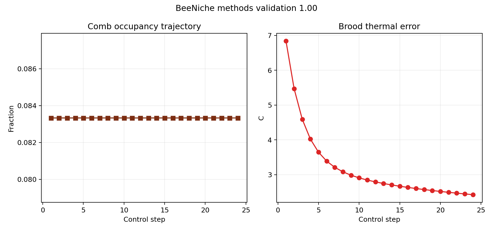

# BeeNiche Methods

BeeNiche models the *constructed environment* of the colony. It owns a
comb grid with 864 voxels (default $18 \times 12 \times 4$),
content fields (brood, food, wax, empty), a thermal field, a foraging
landscape summary, and adapter-style outputs intended to stay
compatible with future BEEHAVE [@becher2014beehave] and Hiveopolis
[@narsicht2020hiveopolis] runtime coupling.

## Comb construction

The comb kernel maintains a four-channel content field over the comb
voxel grid. Wax deposition updates local comb occupancy, neighborhood
density, and content metrics. The wax deposition threshold
(`wax_deposit_threshold = 0.35`) is taken from the bee-comb
construction literature [@johnson2009self]: below the threshold, no new
cell is produced; above it, neighborhood-coordinated deposition raises
local occupancy. The kernel records the final comb occupancy fraction
(0.083 at the end of the integrated run) and the
mean over the rollout so that comb growth is auditable as a time series
rather than only as an endpoint.

## Thermal field

Thermal stepping updates brood-temperature error and supports
fanning/heat-source witnesses. The brood-target band is
$[32, 36]$ \si{\degreeCelsius} centred at 34 \si{\degreeCelsius}
[@kronenberg1982colonial], and the kernel reports the
brood-temperature error
2.424 \si{\degreeCelsius} from that target at the end of
the run, plus the mean over the rollout. Heat sources (active bees
clustered around brood) and heat sinks (foragers returning from cool
ambient) are represented as bounded scalars applied at configured grid
locations. The kernel is not an aerodynamic CFD solver; it is a
*measurable thermoregulation witness*.
The sprint calibration adds a bounded thermoregulation gain of
0.240 on occupied comb cells and
keeps the generated methods/research scorecards pointed at a
brood-temperature error target below 3 \si{\degreeCelsius}.

## Foraging landscape

Landscape helpers summarize patch value, distance, nectar quality,
seasonal forage amplitude, weather penalties, and competition pressure
without requiring an external weather or nectar engine. The foraging
radius spans $[1, 3]$ km, consistent with
documented waggle-dance distance estimates [@couvillon2014waggle].
Landscape state is read-only from BeeBody and BeeBrain (it feeds the
forager observation channel) but writable from BeeSwarm (depletion
through recruited foraging).

## Why BeeNiche matters

BeeNiche is important because it *closes the stack*. Swarm task
pressures modify comb and thermal state; comb and thermal state feed
back into BeeBody (proprioception against comb geometry, thermosensory
state) and into BeeBrain (thermal context in the optic and CX
channels). Without BeeNiche, the swarm and the body operate in an
unspecified environment and the closed-loop semantics break down. The
present implementation is deterministic and serializable; the next
scientific step is seasonal forage and brood-demography coupling
rather than merely increasing grid size.

## Adapter schemas

BeeNiche emits adapter-compatible payloads for BEEHAVE
[@becher2014beehave] (colony-level forager, brood, and food-store
summaries) and Hiveopolis [@narsicht2020hiveopolis] (sensor-stream
abstractions over the comb grid). The adapter shape is not load-bearing
in the current run — no downstream BEEHAVE or Hiveopolis runtime is
invoked — but the schema is preserved so that coupling can happen
without breaking BeeStack's internal contracts.

## Methods-analysis Niche panel

The methods-analysis Niche panel tracks final and mean comb fraction,
final and mean brood-temperature error, brood-target margin within the
configured band, comb-voxel count (864), and forage-radius
midpoint. The panel is written to
`output/figures/methods/beeniche_methods_comb_thermal.png` so niche
claims are anchored to *quantitative traces* rather than to prose alone.

{#fig:niche_methods_comb_thermal}

## Fidelity boundary

BeeNiche is a *voxel comb and thermal kernel with adapter schemas*. It
now includes deterministic seasonal/weather forage witnesses, but it
does not currently model:

- brood demography (egg-to-emergence aging within voxels),
- 3D pollen storage with depletion kinetics, or
- live Hiveopolis or BEEHAVE runtime callbacks.

Each of those is a roadmap item (§15). The architectural commitment is
that adding any of them should *only* modify BeeNiche internals; the
cross-layer `CombGrid` and `PheromoneField` contracts that link
BeeNiche to BeeSwarm and BeeBody do not change.
