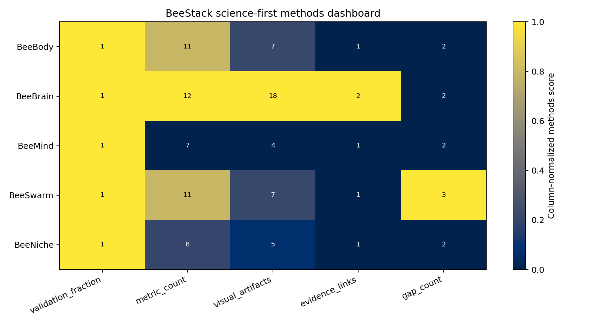
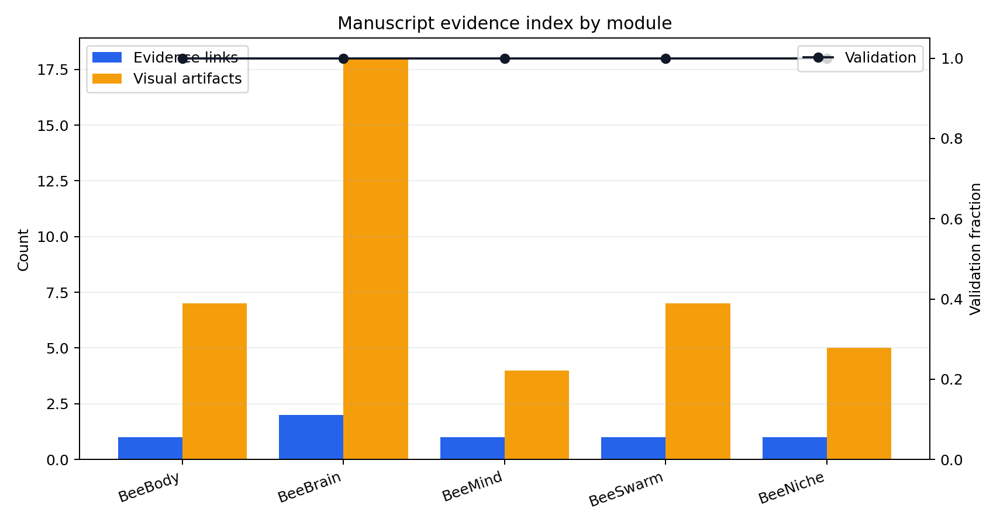

# Visualization and Validation

BeeStack treats visualization as *evidence* only when the backend and
validation status are explicit. A figure without fidelity metadata is not used
as evidence. A figure that declares its provenance, validates its content, and
links back to the script that produced it is reproducible evidence.

## Animation manifest

The animation manifest currently contains 9
animations: 5 FlyBody/MuJoCo
outputs and 4 reduced schematic outputs. The
real group contains BeeBody walking, BeeBody flight, the
BeeSwarm ten-bee collision scene, the BeeSwarm configured waggle dance,
and the long multi-BeeBody waggle-dance scenario. Reduced schematic
outputs are retained for module-level Brain, Mind, recruitment-field
Swarm, and Niche summaries — they are *explanatory*, not biomechanical.

## Multi-level visual checks

Visual checks operate at several levels:

1. **BeeBody verification** checks non-blank dynamic frames, motion
   pixels per second, locomotion mode (walking vs. flight),
   honeybee MJCF cue presence, silhouette overlap with a reference
   bee shape, and — importantly — *absence* of FlyBody debug aids
   inconsistent with a honeybee render. The latest run reports a
   BeeBody visual score of 0.980 and a silhouette
   score of 1.000.
2. **BeeSwarm verification** requires MuJoCo contact reports for
   strict scenes. A strict scene with zero unique contact pairs is
   rejected as evidence; the methods-analysis pass currently records
   15.000 unique bee-contact pairs and
   3 strict scenes, including a long
   BeeBody-backed waggle rollout with its own scene XML and contact
   report.
3. **Research figures** are checked for non-blank static image
   content (rejected if the histogram has fewer than a configured
   number of distinct intensities, since a stalled renderer
   typically writes a uniform frame).
4. **Accessibility captions and alt text** are stored in the
   animation manifest so downstream PDFs and web renders can produce
   accessible output without the human author having to retype them.

## Textual and structural validation

Validation is also textual and structural.

- The **integrity review**
  (`output/reports/beestack_integrity_review.md`) records public APIs,
  contracts, configuration knobs, diagnostics, empirical evidence,
  fidelity labels, and known gaps for every module. It is generated
  from the same source code that the rest of the pipeline imports, so
  it cannot drift from the implementation.
- The **documentation audit**
  (`output/reports/documentation_audit.md`) checks
  generated-output references, manuscript hydration, fidelity
  language, and signposting coverage.
- The **readiness review**
  (`output/reports/project_readiness_review.md`) records
  61 signposted directories and
  prioritizes the next-improvement backlog from the research gaps —
  the current top priority is BeeBrain calcium acquisition completion (P27).

## Methods-analysis figures

The methods-analysis pass adds 7 static methods
figures, JSON sidecar metadata for generated methods and research figures,
6 manuscript evidence links, and a manuscript
figure index with 41 artifact rows. The index maps every cited figure or visual artifact to
its backend (e.g. FlyBody, MuJoCo, Matplotlib), fidelity level (real
3D, reduced kernel, schematic), validation status (passed/passed with
caveats/known gap), and the regeneration command needed to reproduce
it.

{#fig:methods_dashboard}

{#fig:methods_evidence_index}

## Why this matters

The combined effect of these layers is that a reader can audit *any
figure* in this manuscript to determine: which kernel produced it,
what fidelity tier the kernel sits in, whether the figure passed nonblank/quality validation, where its sidecar
metadata lives, and how to regenerate it. That is the operational meaning
of "reproducible research" inside BeeStack: not merely "the code is
public," but "every claim is linkable, every figure is regenerable,
and every fidelity gap is named" [@wilson2017good].

## Failure modes that visualization catches

Empirically, the visual-validation layer catches three recurring
failure modes that pure-numerical validation does not:

1. **Renderer stalls** — a frame loop that emits identical frames is
   detected by the non-blank/motion-pixel checks even when JSON
   diagnostics look healthy.
2. **Body-plan regressions** — a wing or antenna disappearing from
   the MJCF is detected by the MJCF-cue and silhouette checks
   before it propagates to the animation manifest.
3. **Contact-physics gaps** — a multi-bee scene that does not
   produce any unique contact pairs (a configuration error in the
   contact-proxy geoms) is rejected as evidence before it reaches the
   methods-analysis Swarm panel.

Each failure mode is represented by a generated diagnostic or
regression-style test in `tests/`, so the manuscript claim stays at the
level of what the validators check rather than undocumented debugging
history.
